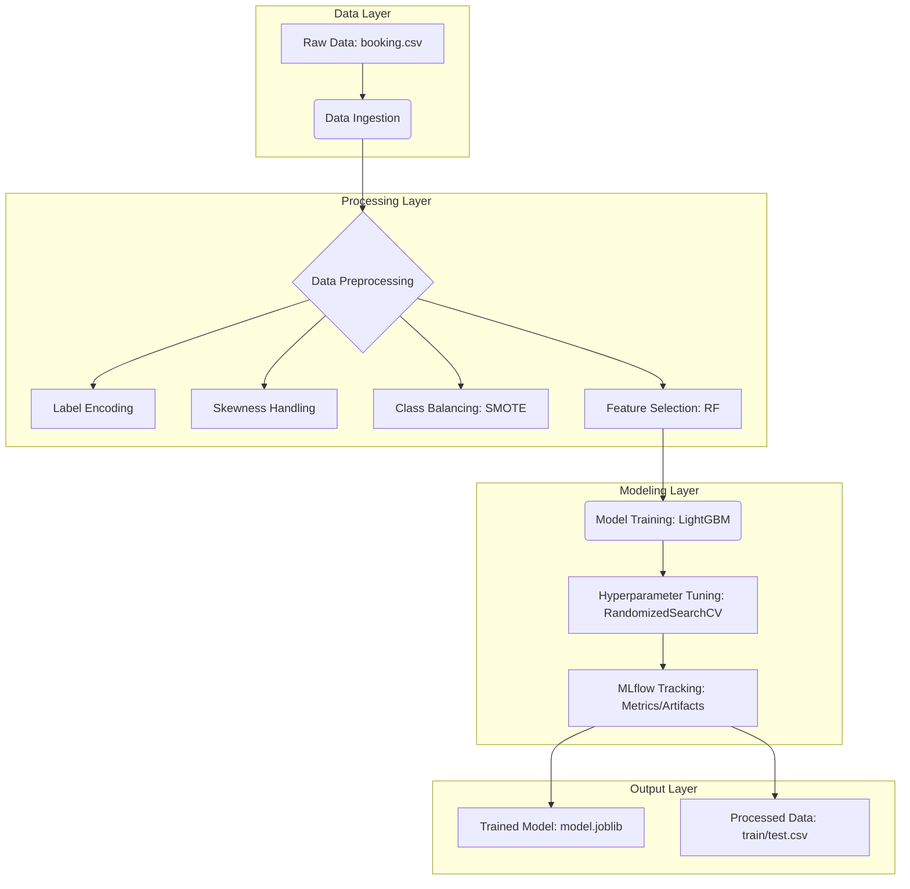

# 🏨 Hotel Booking Prediction - MLOps Pipeline

[](https://www.python.org/)
[](https://mlflow.org/)
[](https://opensource.org/licenses/MIT)

## 📌 Project Overview
This project implements a robust MLOps pipeline for predicting hotel booking cancellations. It leverages modern data engineering and machine learning practices, including automated data ingestion, preprocessing with class balancing (SMOTE), feature selection, and model training with hyperparameter optimization and MLflow tracking.

---

## 🏗️ Project Architecture & Workflow

The project follows a modular architecture designed for scalability and maintainability.



---

## 🛠️ Technology Stack
- **Languages**: Python 3.8+
- **Machine Learning**: LightGBM, Scikit-learn
- **Data Manipulation**: Pandas, NumPy
- **MLOps**: MLflow (Experiment Tracking & Artifact Management)
- **Visualization**: Matplotlib, Seaborn
- **Development**: Jupyter Notebooks, Modular Python Scripts

---

## 📂 Directory Structure

```text
.
├── artifacts/               # Data and Model artifacts (versioned/ignored)
├── config/                  # Configuration YAMLs and Python configs
│   ├── config.yaml          # Hyperparameters and processing flags
│   └── path_config.py       # Centralized path management
├── logs/                    # Project runtime logs
├── notebook/                # Exploratory Data Analysis and experimentation
├── pipeline/                # Orchestration scripts for the end-to-end flow
│   └── training_pipeline.py # Main training orchestration
├── src/                     # Core project source code
│   ├── data_ingestion.py    # Raw data loading and splitting
│   ├── data_preprocessing.py # Transformation and feature engineering
│   ├── model_training.py    # Training and MLflow integration
│   ├── logger.py            # Custom logging setup
│   └── custom_exception.py  # Error handling framework
├── utils/                   # Shared utility functions
├── .gitignore               # Optimized ignore patterns
├── README.md                # Project documentation
└── setup.py                 # Package setup and dependencies
```

---

## 🚀 Getting Started

### 1. Installation
Clone the repository and install the dependencies in a virtual environment:

```bash
git clone https://github.com/ankushsingh003/APEX-FORGE.git
cd mlops_hotel_booking_pred
pip install -r requirements.txt
# OR
pip install -e .
```

### 2. Running the Pipeline
To execute the end-to-end training pipeline:

```bash
python pipeline/training_pipeline.py
```

### 3. MLflow Tracking
View experiment results locally:

```bash
mlflow ui
```

---

## ⚡ Key Features
- **Scalable Pipeline**: Separated components for ingestion, processing, and training.
- **Advanced Preprocessing**: Automated handling of categorical variables and numerical skewness.
- **Class Balancing**: Implementation of SMOTE to address data imbalance in booking statuses.
- **Experiment Tracking**: Integrated MLflow to log metrics (Accuracy, F1, Precision, Recall) and artifacts (models, datasets).
- **Professional Logging**: custom logger for detailed runtime monitoring.

---

## 📄 License
This project is licensed under the MIT License - see the [LICENSE](LICENSE) file for details.
